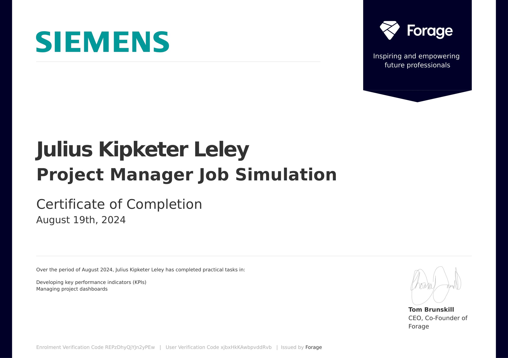

# 🛠️ Siemens Project Management – Forage Simulation

This repository showcases my work from the Siemens Project Management virtual job simulation on Forage. The program simulated real-world project management tasks in a rail infrastructure context.

## 🧠 Skills Demonstrated

- Strategic planning and KPI development
- Dashboard management using Excel
- Data analysis for project tracking
- Effective communication of project progress

## 📁 Contents

- `Project_Plan.xlsx`: Detailed project plan with timelines and milestones.
- `KPI_Dashboard.xlsx`: Dashboard tracking key performance indicators.
- `Progress_Report.pdf`: Report summarizing project status and recommendations.

## 🔗 Certificate

## 📌 About Me

I'm **Julius Kipketer Leley**, a seasoned Project Manager with a strong foundation in data analytics and IT solutions.

- 📜 Certifications: IBM Data Analyst, Google Data Analytics, PMP, PRINCE2
- 🌍 Seeking roles in IT Project Management and Digital Transformation

## 🔗 Connect with Me

- [LinkedIn](https://www.linkedin.com/in/julius-kipketer-leley-a885b011)
- [GitHub](https://github.com/pkomot)
